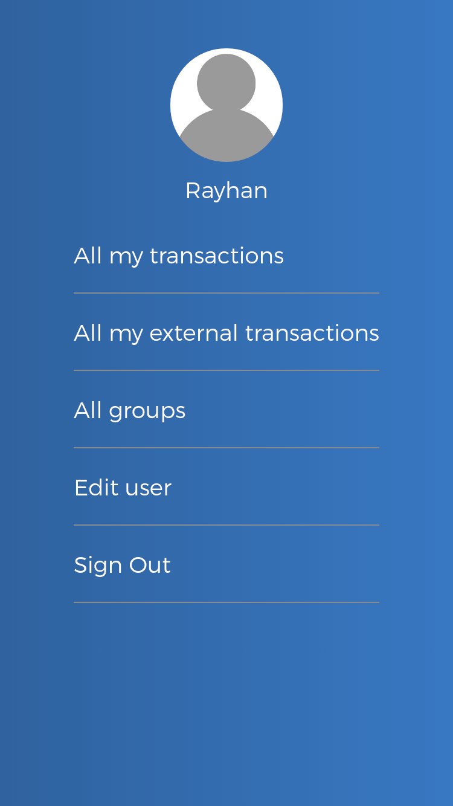
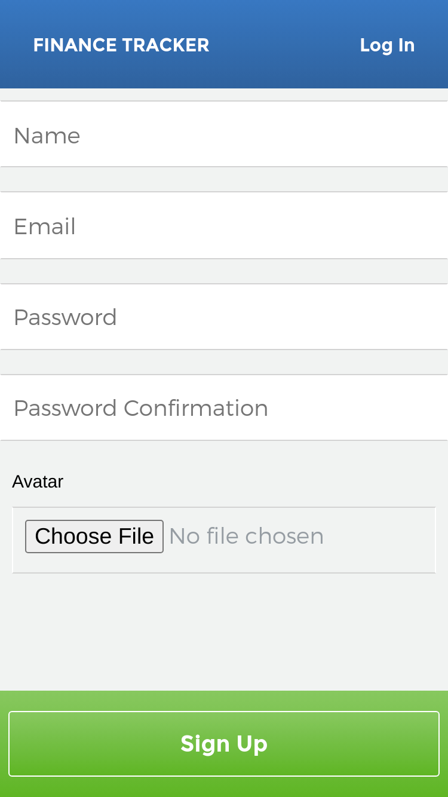
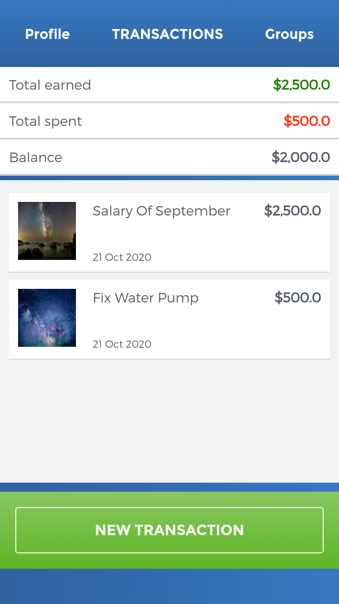
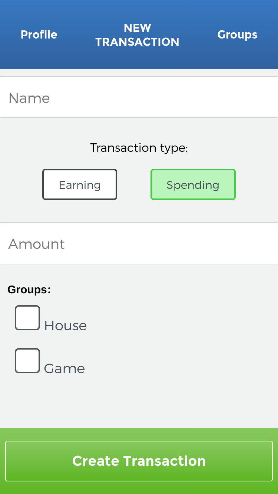
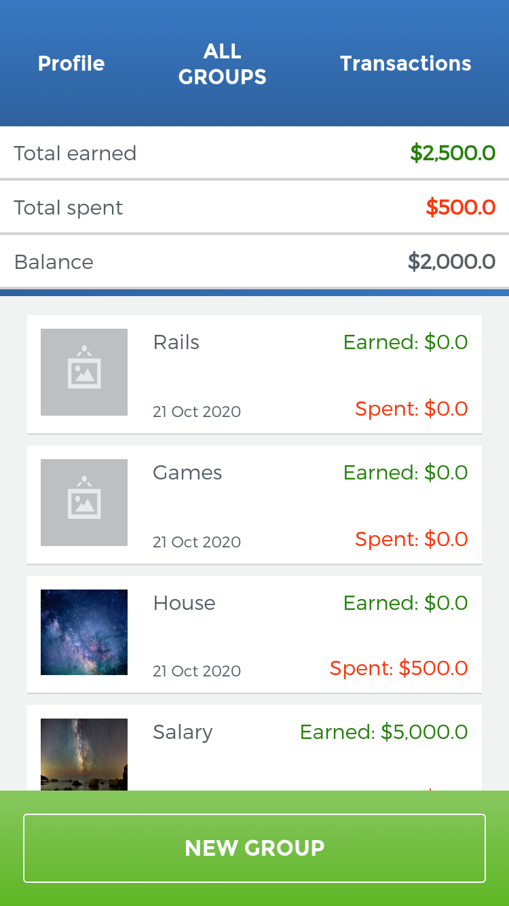
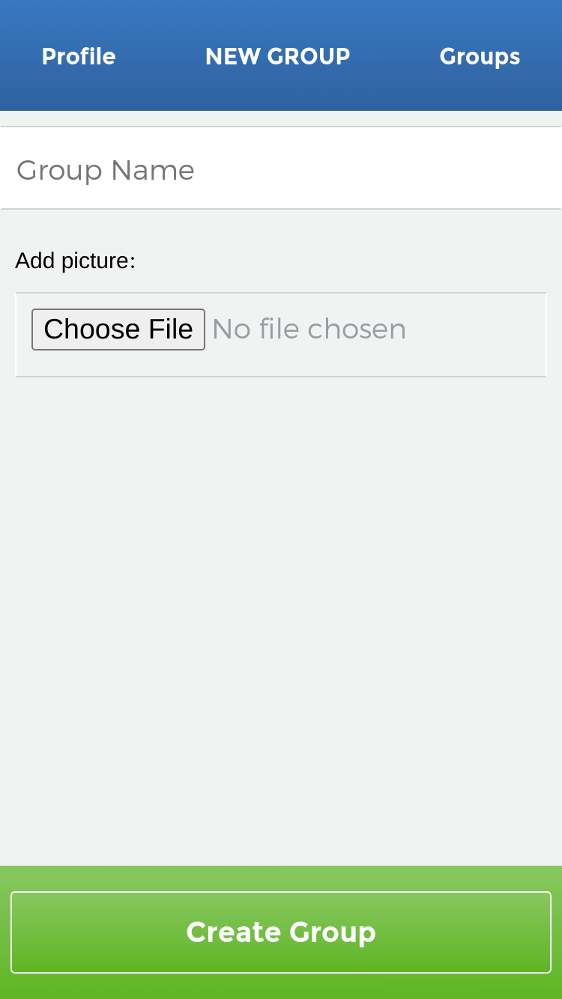

# Finance-Tracker

## Project Description

This is an app which tracks finance. Users can create transactions and groups. The transaction can have groups. Also a transaction can be a earning transaction or a spending transaction. That means users can track their earning and spending at the same time. 

Users can see their total earning and spending. And also a balance is calculated using earning and spending. So this app will help a user to record their total finance.

Users can upload profile images and group images. Also users can delete or update the transactions, groups and images.  

### Screenshot

|Profie Page|Sign Up Page|
|-|-|
|||
|||

|Transactions Page|Create Transaction Page|
|-|-|
|||
|||

|Groups Page|Create Group Page|
|-|-|
|||
|||

## Built With

- Ruby 2.7.1
- Ruby on Rails 6.0.3.4

## Tested with
- Rspec
- Capybara

## How to run this project on your local machine

### Prerequisites
1. You should have ruby installed.(This project was tested on version `2.7.1`)
1. You should have rails installed.(This project was tested on version `Rails 6.0.3.4`)
1. You should have bundler installed.(This project was tested with Bundler version `2.1.4`)

   
### Steps to follow
1. Clone the repository to your local machine using `git clone git@github.com:ershadul1/finance-tracker.git`
1. On your local machine, navigate to the finance-tracker folder using `cd finance-tracker` in your terminal
1. Install all the gems for the project by running `bundle` in your terminal
1. Create the database using this command
`bin/rake db:create`
1. Migrate the database using this command
`bin/rake db:migrate`
1. Start the server by using this command.
`bin/rails server`

1. Open this link in your favorite browser `http://localhost:3000`

## Live Demo

- [Finance Tracker](https://agile-mesa-88353.herokuapp.com/)

## Contributions

  There are two ways of contributing to this project:

1.  If you see something wrong or not working, please check [the issue tracker section](https://github.com/ershadul1/finance-tracker/issues), if that problem you met is not in already opened issues then open the issue by clicking on `new issue` button.

2.  If you have a solution to that, and you are willing to work on it, follow the below steps to contribute:
    1.  Fork this repository
    1.  Clone it on your local computer by running `git clone git@github.com:ershadul1/finance-tracker.git` __Replace *ershadul1* with the username you use on github__
    1.  Open the cloned repository which appears as a folder on your local computer with your favorite code editor
    1.  Create a separate branch off the *master branch*,
    1.  Write your codes which fix the issue you found
    1.  Commit and push the branch you created
    1.  Raise a pull request, comparing your new created branch with our original master branch [here](https://github.com/ershadul1/finance-tracker)

## Authors

👤 **Ershadul Rayhan**

- Github: [@ershadul1](https://github.com/ershadul1)
- Twitter: [@ErshadulRayhan](https://twitter.com/ErshadulRayhan)
- Linkedin: [ErshadulRayhan](https://www.linkedin.com/in/ershadulrayhan/)
- Email:  ershadul.rayhan@gmail.com

## Show your support

Give a ⭐️ if you like this project!

## Acknowledgments
- The design of the project was originally taken from [behance](https://www.behance.net/gallery/19759151/Snapscan-iOs-design-and-branding?tracking_source=) created by [Gregoire Vella](https://www.behance.net/gregoirevella)
- This project was inspired by the [Microverse](https:www.microverse.org) program